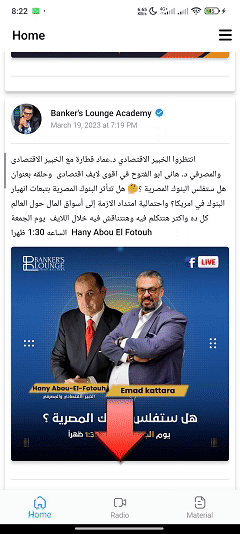
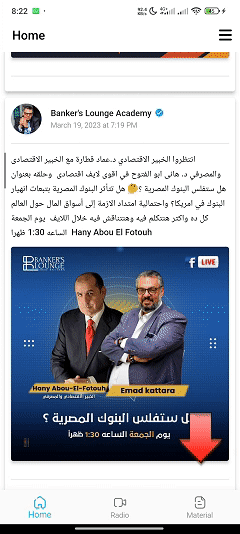
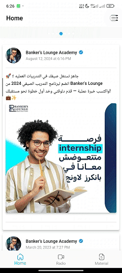
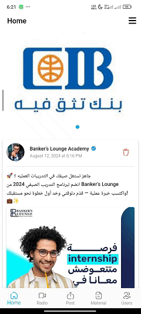
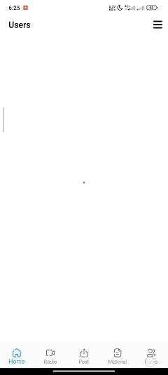

# Banker's Lounge App

Banker's Lounge Company [Linkedin](https://www.linkedin.com/company/bankers-lounge/) owns this application and has been uploaded to [Google Play Store](https://play.google.com/store/apps/details?id=com.emadkattara.bankerslounge&hl=en)
This application provides a user interface and an administrative interface for two main purposes
First: Follow the banking news and opportunities provided by Banker's Lounge, where Banker's Lounge uploads these news and events from the admin interface
Second: The application provides the educational material provided by the institution. At first, this content is locked and the user requests permission and the supervisors grant it, knowing that it is not possible to take a screenshot while viewing the material.
## Features:
### For Users:
1. Authentication & SignUp
The app uses Firebase Authentication to allow users to create an account and log in. Users can log in using their email and password 

  

2. Show posts and banners (news and opportunities) 
View posts and banners and can click on it to redirect to link of event

  

3. Radio channel live on youtube

  

4. send a request to access material of the course

  

5. After approval on request prevent the user from taking screenshots or screen recording

  

https://github.com/user-attachments/assets/cf940f60-0bd9-424a-b27d-ed9110e0366c

6. show all social media pages and location

  

### For Admins:
1. Create a Post and put a redirect link

  

2. Create a Banner and put a redirect link
View posts and banners and can click on it to redirect to link of event

  

3. Create a Notification with photo
Sending a notification that may contain an image to a specific group of users that can be identified, such as (all users - those who have access to the course material - those who follow the news - a specific governorate)

  

4. search for users 
can search for users and approve request and send message by whatsapp or send email or call the number of user

  

